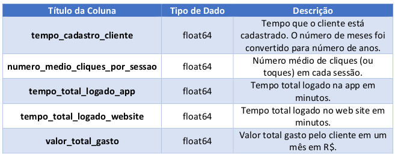

## **Regressão Linear Aplicada em E-Commerce**

### Objetivo

#### A ideia principal aqui é compreender como encontrar os melhores coeficientes para a regressão linear e entender o que eles representam em um problema de negócio.
#### Neste trabalho vamos usar um modelo como base e outros dois (Ridge e Lasso) na tentativa de encontrar o melhor modelo.
#### Faremos todo o processo de exploração, limpeza e análise dos dados, e em seguida fazemos as criações dos modelos e suas respectivas métricas.

### Dados

#### Os dados usados neste trabalho são fictícios e servem para emular uma situação real. A figura a seguir mostra o dicionário dos dados usados.

